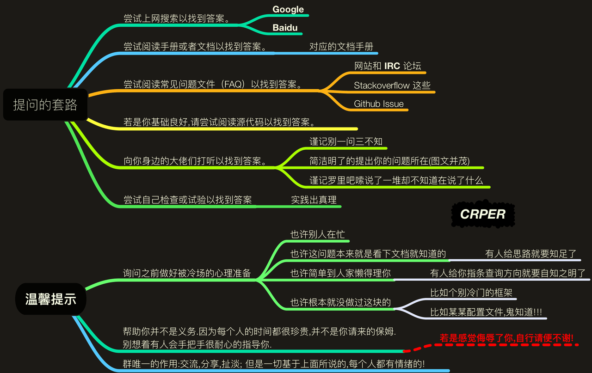

# 错误的提问姿态

## 现状

我们假定一个情况，如果你是一个医生，患者过来告诉你，我浑身都疼，医生我该怎么办啊。

然后你要慢慢询问他的问题，接着你要问各种问题各种检查然后去看，如果有十个人一百个人都这么问，你肯定会受不了的吧。

事实上, 如果希望能提高得到回答的概率, 提问者应该学会如何更好地提问. 换句话说, 提问者应该去积极思考 "我可以主动做些什么来让对方更方便地帮助我诊断问题".

如果你的提问方式非常不专业, 很可能没有人愿意关注你的问题, 因为这不仅让人觉得你随便提的问题没那么重要, 而且大家也不愿意花费大量的时间向你来回地咨询.

## 解决

一种非常合适的提问方式是：

> 我在写xxx的时候遇到了xxx的错误（请发截图不要复制粘贴）
>
> &#x20;我的版本是XXX，官方文档给的版本是XXX 我做了这个来试着修正（贴图）
>
> 根据的是XXX上的方法 然后出现了XXX ···········&#x20;
>
> 最后我做的尝试是XXX&#x20;
>
> 问题还是没有解决，现在我该怎么做？

此外, 欢迎大家阅读[别像弱智一样提问](https://github.com/tangx/Stop-Ask-Questions-The-Stupid-Ways/blob/master/README.md), 以及[提问的智慧](https://github.com/ryanhanwu/How-To-Ask-Questions-The-Smart-Way/blob/main/README-zh\_CN.md).&#x20;
